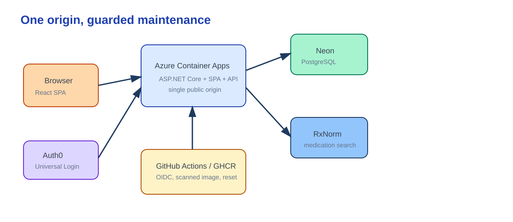

# Harbor Care

Harbor Care is a synthetic coordinated-care demo built with ASP.NET Core, React, and PostgreSQL. Follow one appointment from patient booking through doctor consultation and pharmacist dispensing, then return to the patient to see the updated status.

**Live demo:** https://ca-harbor-care-demo.salmonsea-5286e167.westus.azurecontainerapps.io

The three public demo roles are patient, doctor, and pharmacist. Credentials are shown through the role cards and should be entered privately; the seeded administrator is not a public demo login. Visitor edits are shared and the fictional dataset resets daily at 11:00 UTC. A first visit can cold-start; this is an educational demo, not a clinical system or availability promise.

## Care relay

- Patient books an appointment and later sees only their own status.
- Doctor records a consultation and issues an RxNorm-backed prescription.
- Pharmacist fulfills it; the patient sees the completed handoff without internal pharmacy details.

## Engineering highlights

- Role and ownership authorization, PostgreSQL booking constraints, optimistic concurrency, and transactional prescription/fulfillment transitions.
- A single Azure Container Apps origin serves the React SPA and API; Neon stores the synthetic data.
- GitHub Actions builds a scanned immutable container through OIDC, runs gated database preparation, and maintains the synthetic data reset.

Release and reset evidence, including the 2026-09-23 scheduled reset observation, is in [Milestone 6 evidence](docs/releases/milestone-06-evidence.md). The five authenticated UI captures are private, read-only seeded hosted views; their provenance is recorded with the evidence.

## Run locally

See [the local development guide](docs/development/getting-started.md). It covers local-only configuration, explicit initialization, and the separate synthetic reset command.

## Documentation

- [Recruiter demo guide](docs/demo-guide.md)
- [Portfolio presentation notes](docs/portfolio-presentation.md)
- [Portfolio release architecture](docs/architecture/portfolio-release.md)
- [Delivery and recovery](docs/development/delivery.md)
- [Quality and security gates](docs/development/quality-gates.md)
- [Legacy Java history](docs/history/legacy-java.md)

## Disclaimer

Harbor Care contains only fictional, synthetic data. It is not for clinical use and makes no healthcare-regulatory compliance claim.
