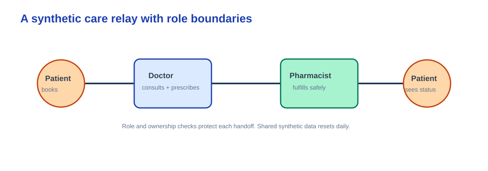

# Harbor Care demo guide

Open the [live demo](https://ca-harbor-care-demo.salmonsea-5286e167.westus.azurecontainerapps.io). Choose a role card, sign in privately, and use the existing seeded view.

1. **Patient:** inspect the itinerary and appointment status.
2. **Doctor:** inspect a completed synthetic consultation and its medication-search panel.
3. **Pharmacist:** inspect a seeded fulfillment and status.

These are three separate roles, not role switching inside one account. The data is shared synthetic demo state and resets daily at 11:00 UTC; do not use it for real care. A cold start can delay the first page. Do not place credentials in screenshots, notes, or issues.

