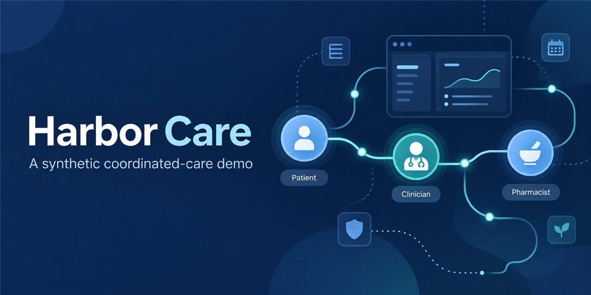
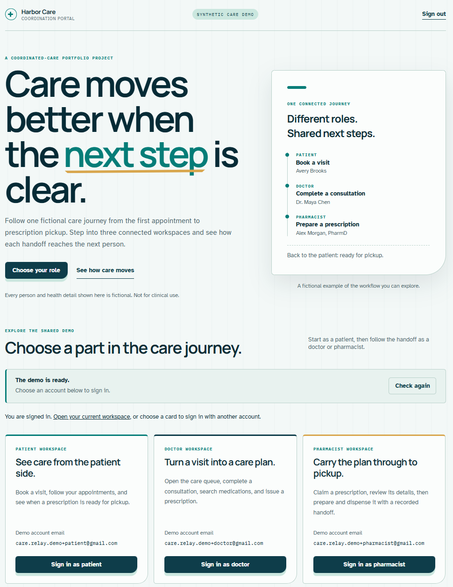
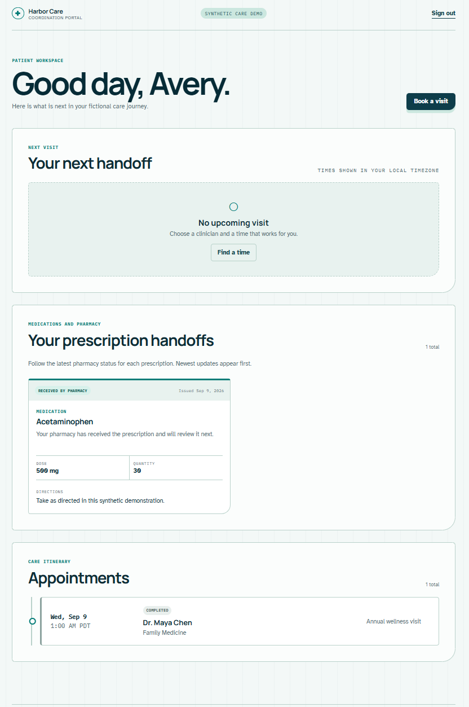
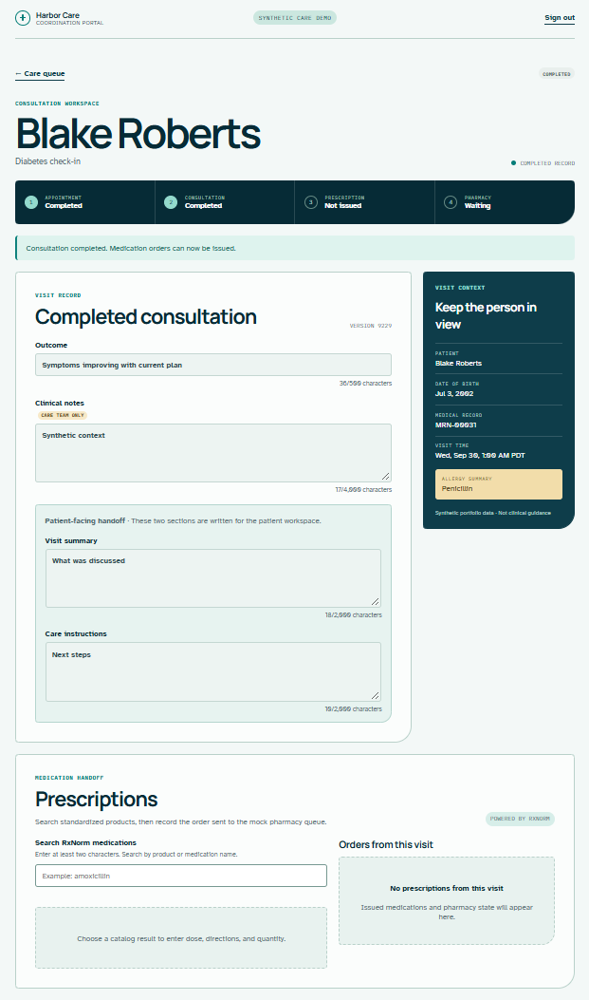
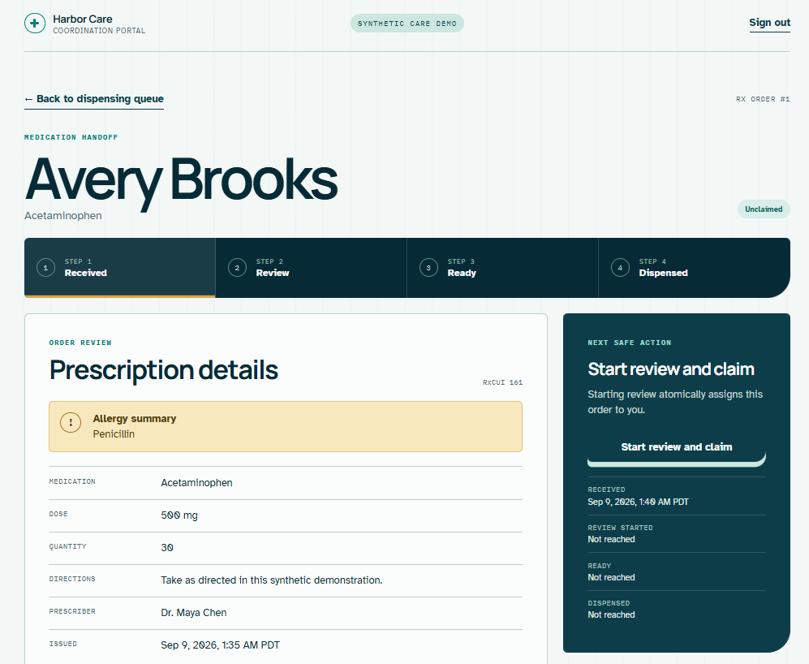
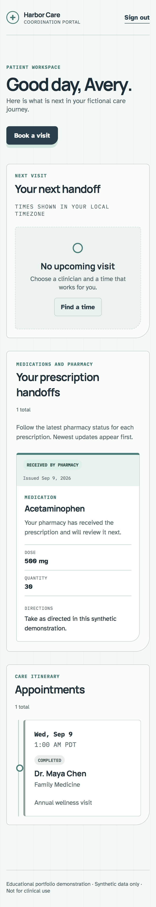

# Harbor Care portfolio presentation

## Story

Harbor Care modernizes the preserved Java/CSV classroom project into a React, ASP.NET Core, and PostgreSQL coordinated-care demo. It keeps the project’s care handoff idea while adding a real HTTP boundary, signed role claims, database constraints, transactional changes, and an operated demo release.

## Gallery

The non-product social card is a local portfolio graphic; it is not configured as repository metadata. The following captures are private, read-only views of the hosted seeded UI; no HTML test fixture or generated UI was used.

## Resume bullets

- Modernized a Java console/CSV project into a React, ASP.NET Core, and PostgreSQL application supporting patient booking, doctor prescribing, and pharmacist fulfillment.
- Implemented role/ownership authorization, PostgreSQL-backed booking constraints, optimistic concurrency, and transactional prescription/fulfillment operations.
- Delivered a scanned immutable container through GitHub Actions/OIDC to Azure Container Apps, with gated database preparation and a verified synthetic-data reset.

## Talking points

- The patient, doctor, and pharmacist work on one synthetic care relay with deliberately different authorization boundaries.
- Reset is maintenance code, not an HTTP endpoint: it validates its target and migration history, locks, reseeds atomically, and has a separate protected manual workflow.
- The public demo uses a single SPA/API origin and makes its operational limits explicit instead of claiming production healthcare readiness.
